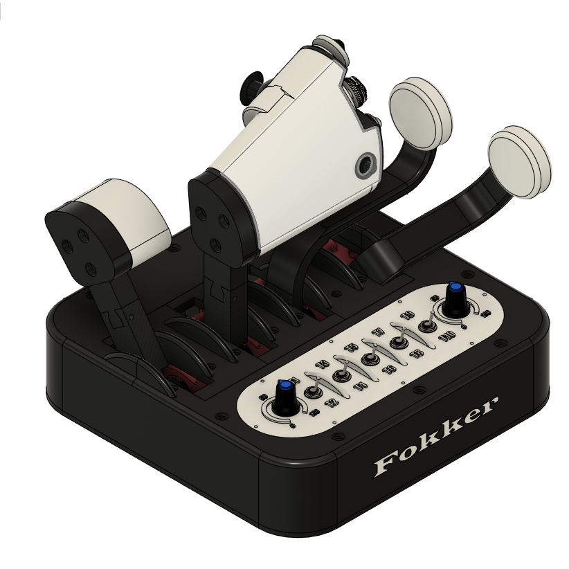
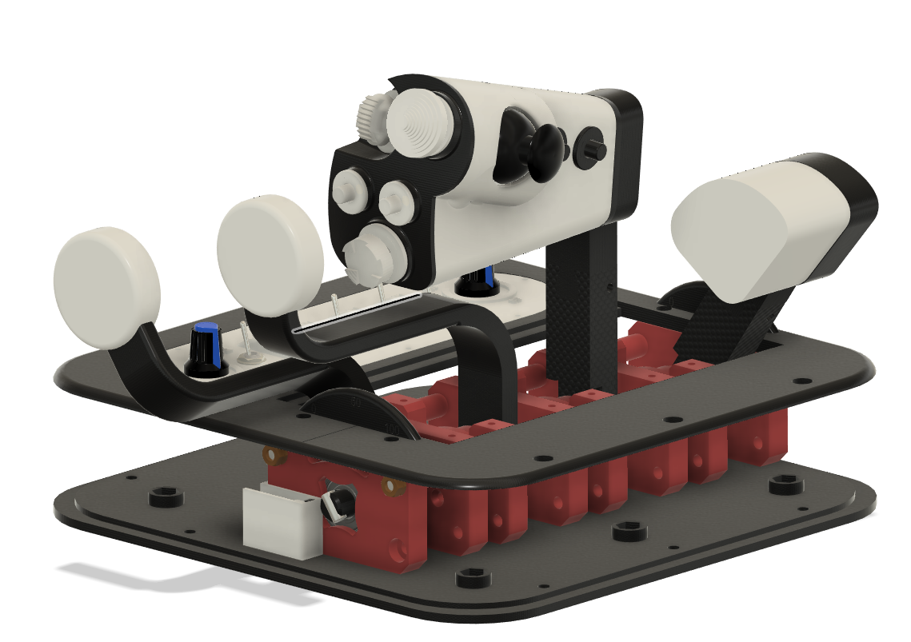
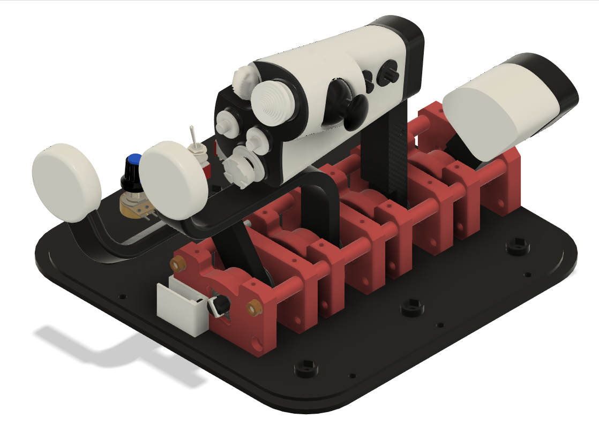

# Throttle-Quadrant "Fokker" - 8 axes and 31 buttons

## 3D Model
You can see assembled 3D model in [this URL](https://a360.co/2Yg0hqr) (password is Throttle)

Attention!!! -  A "small" bug in the lever_arm_n4.stl file has been fixed; it is recommended that those who downloaded the project earlier than 4/09 download new version of this file.

## Printing
 White and black PLA or PLA+ (200x200mm print size required for the box)
 
## Components
- Bearing 6900 (10x22x6mm)  - 8 units
- Adhesive felt - 4 units
- Adhesive non-slip pad 200x200mm - 1 init (optional)
- Arduino ky-023 joystick - 1 unit
- Hall-effect sensor (SS49E for example) - 4 units
- Ceramic capacitor 50V 104 100nF 0.1uf - 4 units
- Cilindrical magnets (5x10mm) - 4 units
- 5-Way Switch 10x10x10mm Multi Direction Switch Touch Reset Button - 3 units
- Push Button 6x6 4.3mm - 5 units
- Miniature toggle switch- on/of/on - 5 units
- Potentiometer (WH148) 10K Ohm (B10K) - 2 units
- Switching Diode (for example 1N4148) - 30 units
- Micro-USB 5pin Micro USB 2.0 Male to USB 2.0 B Type Female Connector Cable 30cm With Panel Mount Hole cables - 1 unit
- Wires - 24-28 AWG 
- Hot Glue Gun - 1 unit
- Two Component Epoxy Glue - 1 unit
- Low-cost STM32F103C8 microcontroller - 1 unit
- [FreeJoy soft and manual](https://github.com/FreeJoy-Team/FreeJoyWiki)

### Screws, nuts, etc…
- M4 threaded rod 190mm - 2 units
- M4 screw 20mm - 26 units
- M4 nut - 32 units
- M3 screw 10mm - 36 units
- M3 screw 20mm - 8 units
- M3 screw 25mm - 2 units
- M3 nut - 10 units
- M2 screw - 8 units
- M1.7 screw - 4 units

##  Images

## Lever assembly and sensor installation

##  Video

## **If you find this design helpful, consider  to support my work and my future projects. Thanks in advance.**
